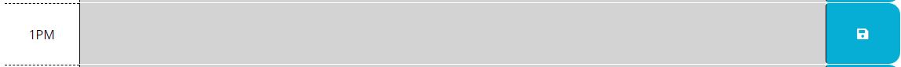

# daily-planner

## Description
Daily Planner to keep track of your own busy schedule!


## Table of Contents 
* [Links](#Links)
* [Usage](#Usage)
* [Acceptance](#AcceptanceCriteria)

## Links

Repo: https://github.com/andrewyu22/daily-planner

Link: https://andrewyu22.github.io/daily-planner/

## Usage

### Show Today's Date


### See your Schedule for today


### Click in the text area to change or add to your planner and click save button on the right



## AcceptanceCriteria

```
GIVEN I am using a daily planner to create a schedule
WHEN I open the planner
THEN the current day is displayed at the top of the calendar
WHEN I scroll down
THEN I am presented with timeblocks for standard business hours
WHEN I view the timeblocks for that day
THEN each timeblock is color coded to indicate whether it is in the past, present, or future
WHEN I click into a timeblock
THEN I can enter an event
WHEN I click the save button for that timeblock
THEN the text for that event is saved in local storage
WHEN I refresh the page
THEN the saved events persist
```